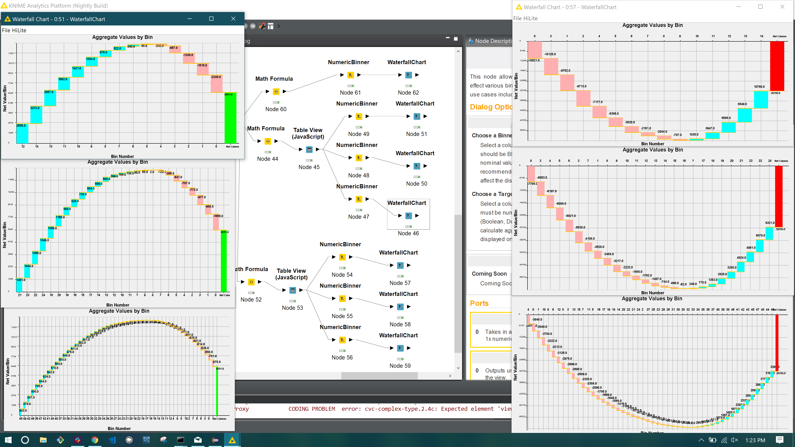

# waterfall_chart_viz
#### Creates a descriptive waterfall chart view when provided Data Table containing a binned column and a target column.    

This node allows you to visualize the bifurcated cummulative effect various bin are having on an net column output. Common applications include finances and modeling change over time.

## Options
### Choose a Binned Column
Select a column from the input table (x-axis). This column should be BINNED (via a previous node or inherently as nominal values). For proper viewing, it is not recommended to use a large quantity of bins (50<) as this may affect the display of the chart.

### Choose a Target Column
Select a column from the input table (y-axis). This column must be numeric; specifically compatible with type Double (Boolean, Double, Integer, Long, SOTA) and is used to calculate aggregate sums for each binned column displayed on the chart

### View Options
Coming soon.

## Ports

### Inport
Takes in a table with minimum 2x columns: 1x binned, 1x numeric.
### Outport
Outputs unaltered input table following the creation of the view.

## Notes
Currently this node supports both net positive and negative net columns. Feel free to open an issue for any bugs that arise.

